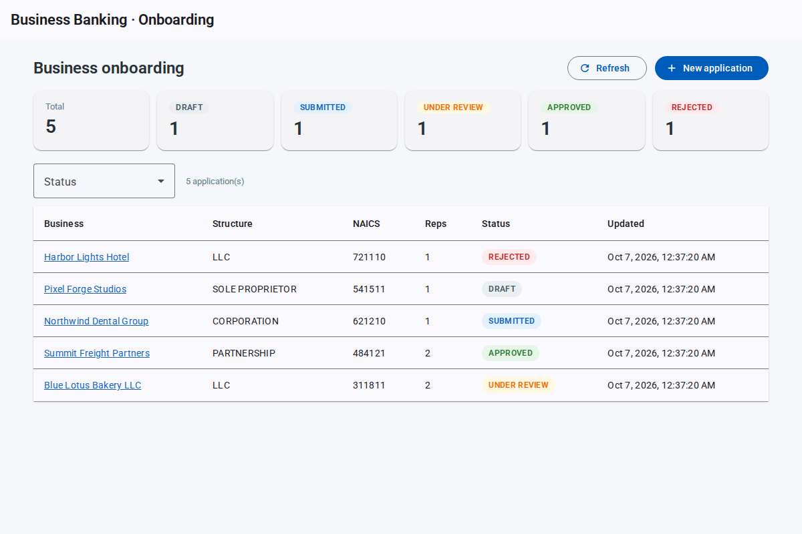
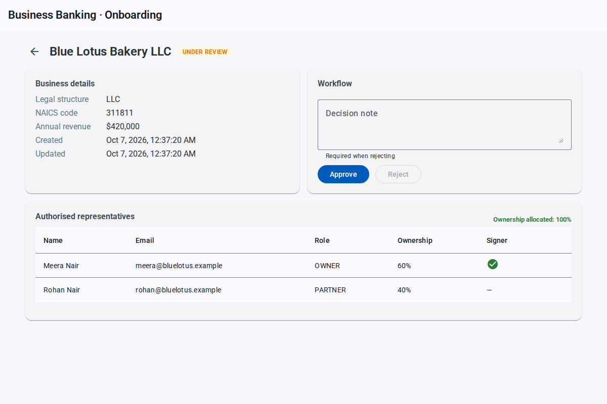

# business-onboarding-dashboard

A small but complete **business-banking onboarding** workflow: an **Angular 18 + Angular Material** dashboard
on top of a **Java 21 / Spring Boot 3** API. Bankers create an application for a business, add its
authorised representatives, classify it with a NAICS industry code, and move it through
`DRAFT → SUBMITTED → UNDER_REVIEW → APPROVED | REJECTED`.

It is modelled on the kind of client-and-banker journeys I build at work (multi-authorised-representative
onboarding, NAICS classification), reduced to something that runs on a laptop with one command.

[](https://github.com/eklavyachamp28/business-onboarding-dashboard/actions/workflows/ci.yml)





## What it does

- **Dashboard** — status counts, click a card to filter, table of applications. One RxJS `combineLatest`
  view-model stream re-queries the API whenever the filter or a manual refresh changes.
- **New application** — reactive form with validation and a **NAICS autocomplete** (debounced lookup against
  the API; results ranked by code prefix, then title keywords).
- **Application detail** — business facts, representatives table, add/remove representatives while in
  `DRAFT`, and workflow buttons that only appear when the transition is legal. The reason a draft can't be
  submitted yet is shown up front, mirroring the server rules.
- **Business rules (server-side, tested)** — total ownership can never exceed 100 %; one email per
  representative per application; at least one authorised signer and a NAICS code before submission; a
  rejection needs a reason; final states are immutable; illegal transitions return `409`.
- **Consistent errors** — the API returns RFC 9457 `ProblemDetail` (with a field → message map for
  validation failures), which the Angular client turns into a snackbar message.

## Stack

| Layer | Tech |
|---|---|
| Front end | Angular 18 (standalone components, lazy routes), Angular Material, RxJS, Reactive Forms, Karma/Jasmine |
| API | Spring Boot 3.3, Spring MVC, Bean Validation, Spring Data JPA, Flyway, springdoc-openapi |
| Data | H2 in PostgreSQL mode (point the datasource at a real PostgreSQL — the Flyway migration is Postgres-compatible) |
| Ops | Dockerfiles for both apps, `docker-compose`, nginx reverse proxy, GitHub Actions CI |

## Run it

```bash
docker compose up --build
# UI:       http://localhost:8081
# API docs: http://localhost:8080/swagger-ui.html
```

The `demo` profile seeds five applications in different states.

### Local development

```bash
# API with hot reload
cd backend && mvn spring-boot:run

# UI (proxies /api to :8080)
cd frontend && npm ci && npx ng serve
```

## Tests

```bash
cd backend  && mvn verify                 # 15 tests: service rules + MockMvc API tests
cd frontend && npx ng test --watch=false  # 9 specs: API service, error mapping, detail-page logic
```

## API

| Method | Path | Purpose |
|---|---|---|
| `GET` | `/api/applications?status=` | List (newest first), optional status filter |
| `GET` | `/api/applications/summary` | Count per status (every status present, even at 0) |
| `POST` | `/api/applications` | Create a `DRAFT` |
| `GET` / `PUT` | `/api/applications/{id}` | Read / edit details (edit only while `DRAFT`) |
| `POST` | `/api/applications/{id}/representatives` | Add a representative |
| `DELETE` | `/api/applications/{id}/representatives/{repId}` | Remove a representative |
| `POST` | `/api/applications/{id}/submit` · `/review` · `/approve` · `/reject` | Workflow transitions |
| `GET` | `/api/naics?q=` | Search NAICS codes |

## Project layout

```
backend/src/main/java/com/aayusheklavya/onboarding
├── api/        controllers, request/response records, ProblemDetail handler
├── domain/     BusinessApplication (state machine), Representative, repository
├── service/    OnboardingService (business rules), NaicsService (CSV lookup)
└── config/     CORS, demo seed data
frontend/src/app
├── core/                models, OnboardingApiService, problem → message mapping
├── dashboard/           summary cards + filterable table
├── new-application/     reactive form with NAICS autocomplete
├── application-detail/  representatives + workflow actions
└── shared/              status chip
```

## Roadmap

- [ ] Spring Security with OAuth2 resource server; banker vs. client roles on the workflow endpoints
- [ ] Surface optimistic-locking conflicts in the UI (the entity already carries `@Version`)
- [ ] Document upload per representative (ID proof) with a virus-scan hook
- [ ] Audit trail of every transition (who / when / note)
